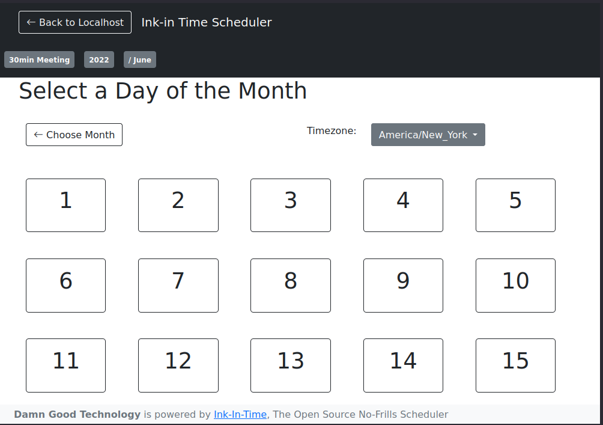

# About the Project



Appointment scheduling/booking application that aims to be super-simple, and open source!

- Privacy-friendly
- Deployable in minutes!
- Easy docker deployment
- Few dependencies
- Timeblock detection through ical references
- Highly Configurable (via yaml)
- Creates [Jit.si](https://meet.jit.si) meetings by default.
- No Log-in needed!
- Timezone detection/selection
- `block/YYY/MM/DD` selection to make appointment choosing easy
  ("Choose a time to meet tomorrow" → `30min/2022/9/30` )

# Set Up

### Docker (recommended)

Copy [the example config](./config/iit.example.yml) to your project directory.
Modify anything with the `@REPLACEME` tag. The server will warn you if it
contains invalid values.

```yml
services:
  iit:
    image: damngoodtech/ink-in-time:latest
    # This is required to provide a configuration
    volumes:
      - "./iit.yml:/app/iit.yml"
    ports:
      - "5000:5000" # exposes the port to the host
  
  web: # or whatever your "main" server service is
    depends:
      - iit
```

Now just configure your server to let some path like `/schedule` refer
to port `5000` and you're golden!

### Non-Docker

Copy `config/iit-example.yml` to `config/iit.yml`. Modify it accordingly. There
are many options that are required. If something isn't configured correctly
the service won't start.

Install packages:

```shell
> pypi install
```

Run the server.

```shell
> pypi run python -m src.main
```

You may also provide custom configs by provding the `IIT_YML` environment variable:

```shell
> IIT_YML='/path/to/my/iit.yml' pypi run python -m src.main
```

If an `IIT_YML` file is not provide it will poll the following paths to
find the first available config:

- `/app/iit.yml` (**NOTE**: for docker installs ONLY!)
- `/etc/ink-in-time/iit.yml`
- `$HOME/.ink-in-time/config/iit.yml`
- `$PROJ_DIR/config/iit.yml`

Additional environment variables that may be of interest:

<dl>
  <dt><code>FLASK_DOTENV</code></dt>
  <dd>Override the current environment with the <code>.env</code> file</dd>
  <dt><code>FLASK_DEBUG</code></dt>
  <dd>Run flask in DEBUG mode</dd>
</dl>

### Overriding templates

Because this service uses jinja2 for templating, you can absolutely
override any template you want!

To do this, copy the `/app/templates` directory (from the docker container) to a local file on the host, then add the directory as a volume:

```yml
services:
  # ...
  iit:
    # ...
    volumes:
      - "./my-awesome-templates:/app/templates"
      # ...
```

# Getting Involved

1. [File and issue](https://github.com/src-r-r/ink-in-time/issues)
   - Make sure to include details on the issue. If it's cosmetic, attach screenshots.
   - If you think you'd like to take on the issue, say so.
   - Promote a lively discussion & healthy debate.
2. Fork this repository
3. Start a new branch based off the format `<your_username><year>WW<work_week>_<ticket>_<summary_of_issue>`, e.g. `rickastley2022WW42_123_email-generates-zoom-links`.
3. Make sure you start up the mock docker containers.
4. Once you have a bug fix, run the unit tests (see _Running the tests_ below).
5. Push your fix to your branch.
6. Create a pull request, detailing your fixes.

# Other Ways to Contribute

- Donate money to the projecct <https://ko-fi.com/summary/c05d8728-c615-45f7-9f5d-5fe3b57895c9>.
  Donors will be listed in the README. Minumum donation $1, **SUGGESTED: $10 OR MORE**
- [Hire me!](https://damngood.tech) I'm a senior developer with over 10 years experience.
  Currently open to clients tackling the impossible!

# Customizations

If you'd like customizations for your organization, I'd love to help you out.
Please pick a time to chat at <https://damngood.tech/schedule/60min/>.

# Testing

## Running the tests

> Hint: if you want to test the calendar blocking feature, it's **HIGHLY**
> recommended you pull from an ics mock server. See below.

```
> pypi run pytest src/tests.py
```

Since the server runs a background process to compile the time blocks,
sometimes this will result in a failure. See the debug messages for details.
This usually involves a race condition to detect that the `.compilepid` has
been created.

## Mock Server

The mock server uses `node-mock-server` to serve ICS files at `localhost:5002/ics`.

To use the mock server, do the following:

```shell
> npm i
> npm run ics # starts the ICS mock server.
```

Go to `localhost:5002/ui` if it isn't open already. There you see the endpoints

Copy one of those endpoints to the `calendars` configuration.

Just keep the server up and you'll pull from those endpoints for testing!

Note you will see errors from `icalendar` during the compilation process. These can be ignored.

> **WARNING**: Any data you place in the `mocking` directory will be commited to git!
> A safer directory is `mock_data`, which is ignored.

## Generating Mock icals

To generate your own mock data, run:

```shell
> pypi -m main.fakeics
```

The data is stored in `<project_dir>/mock_data/ics/<funny-name>.ics`.

The files can then be copied to new endpoints if you wish.
